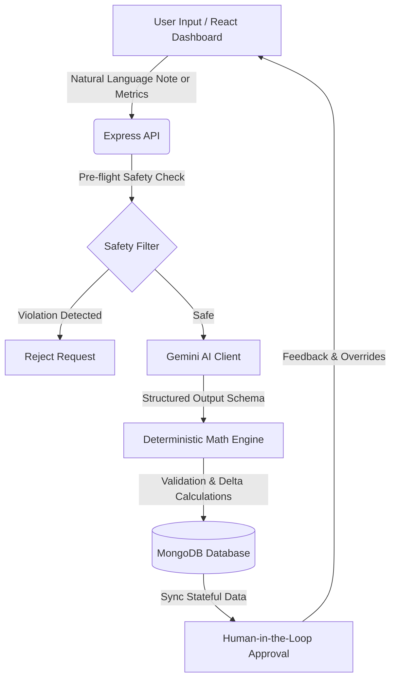

# PulseAI: Longitudinal Health & Nutrition Review Agent

## Executive Summary & Overview

Welcome to **PulseAI**, an advanced Longitudinal Health & Nutrition Review Agent. PulseAI is designed to track, analyze, and optimize human health metrics over time by synergizing the natural language understanding capabilities of Large Language Models (LLMs) with the strict, deterministic accuracy of traditional software engines. 

Unlike conventional health apps that rely solely on rigid data entry or purely conversational AI chatbots that suffer from hallucinations, PulseAI offers a robust hybrid approach. Users can log their daily habits, meals, and metrics in pure natural language. The agent extracts structured data, identifies behavioral trends over weeks and months, and dynamically generates evolving, personalized health plans. 

Our core philosophy is **Safe, Deterministic, and Auditable AI**. We enforce strict safety guardrails, demand human-in-the-loop (HITL) approval for any generated health plans, and maintain a rigorous audit trail of every AI decision made.

---

## System Architecture & Design Decisions

### Data Flow Architecture



### Design Decision: Deterministic Math vs. AI Reasoning

A critical architectural decision was the strict separation of **reasoning** (handled by the LLM) from **computation** (handled by the Deterministic Math Engine). 

**The Problem:** LLMs are exceptional at understanding context, parsing natural language, and recognizing abstract patterns, but they are notoriously unreliable at arithmetic. Relying on an LLM to calculate caloric deficits, macro splits, or 7-day weight moving averages introduces the risk of dangerous hallucinations.

**The Solution:** PulseAI restricts the LLM exclusively to qualitative reasoning and unstructured data extraction. Once the AI extracts raw data (e.g., estimating calories from a text description of a meal), the numbers are immediately passed to our Deterministic Math Engine. The engine handles all aggregations, regressions, and delta calculations using standard, testable mathematics. This ensures absolute precision in the metrics presented to the user.

---

## Key Features & Innovations

1. **Natural Language Meal Parsing & Macro Extraction**
   Instead of searching through endless food databases, users simply write, *"Had a chicken salad and a latte."* The agent extracts this into structured data, estimating caloric and macronutrient breakdowns in real-time.
   
2. **Deterministic Trend Analysis**
   The system calculates robust longitudinal analytics, including linear regression for weight trajectories, 7-day rolling averages, and behavioral anomaly detection, entirely via deterministic algorithms.

3. **Stateful Plan Versioning (Human-in-the-Loop)**
   Health plans are generated dynamically based on ongoing trends but are never activated autonomously. Plans move through a strict lifecycle (`DRAFT` → `ACTIVE` or `REJECTED`). Versioning (e.g., `v1.0`, `v1.1`) allows users to review, override, and approve changes before they impact their goals.

4. **Enterprise Audit Trail & Transparency**
   Every action taken by the AI is logged. The audit trail captures the raw user input, the AI's generated output, any user corrections (overrides), and a calculated **Uncertainty Index** representing the agent's confidence in its extraction.

---

## Technology Stack

PulseAI is built on a modern, robust, and scalable stack:

**Backend:**
- Node.js & Express
- TypeScript
- MongoDB & Mongoose (Data persistence)
- Google Gemini Pro (LLM integration)

**Frontend:**
- React (Vite)
- Tailwind CSS (Styling & layout)
- Recharts (Data visualization)
- Lucide Icons (Iconography)

---

## Local Setup & Quick Start Guide

Follow these steps to get PulseAI running locally on your machine.

### 1. Clone the Repository & Install Dependencies
```bash
git clone <repository_url> longitudinal-health-agent
cd longitudinal-health-agent

# Install backend dependencies
npm install

# Install frontend dependencies
cd client
npm install
cd ..
```

### 2. Environment Setup
Create a `.env` file in the root directory and populate it with the following:
```env
PORT=5000
MONGODB_URI=mongodb://localhost:27017/pulseai
GEMINI_API_KEY=your_gemini_api_key_here
```
*(Ensure you have MongoDB running locally or provide a MongoDB Atlas URI).*

### 3. Seed the Database
Populate the database with sample user data, historical logs, and mock plans:
```bash
npm run seed
```

### 4. Run the Application
Start the backend Express server:
```bash
# In the root directory
npm run dev
```

Start the frontend React dashboard:
```bash
# Open a new terminal window
cd client
npm run dev
```

Navigate to `http://localhost:3000` to view the dashboard!

---

## API Reference Table

| Endpoint | Method | Description |
|---|---|---|
| `/api/logs` | `POST` | Create or update daily core health metrics (weight, sleep, mood). |
| `/api/logs/:userId/extract-meals` | `POST` | Parses natural language notes via LLM to extract structured meal data. |
| `/api/users/:userId/trends` | `GET` | Fetches longitudinal analytics, deltas, and regressions computed by the math engine. |
| `/api/plans/:userId/generate` | `POST` | Triggers the AI to analyze 14-day trends and draft a new health plan. |
| `/api/plans/:planId/approve` | `PUT` | HITL approval step. Transitions a `DRAFT` plan to `ACTIVE` (or rejects it). |
| `/api/audit/:userId` | `GET` | Retrieves the immutable audit log of AI decisions and user overrides. |
